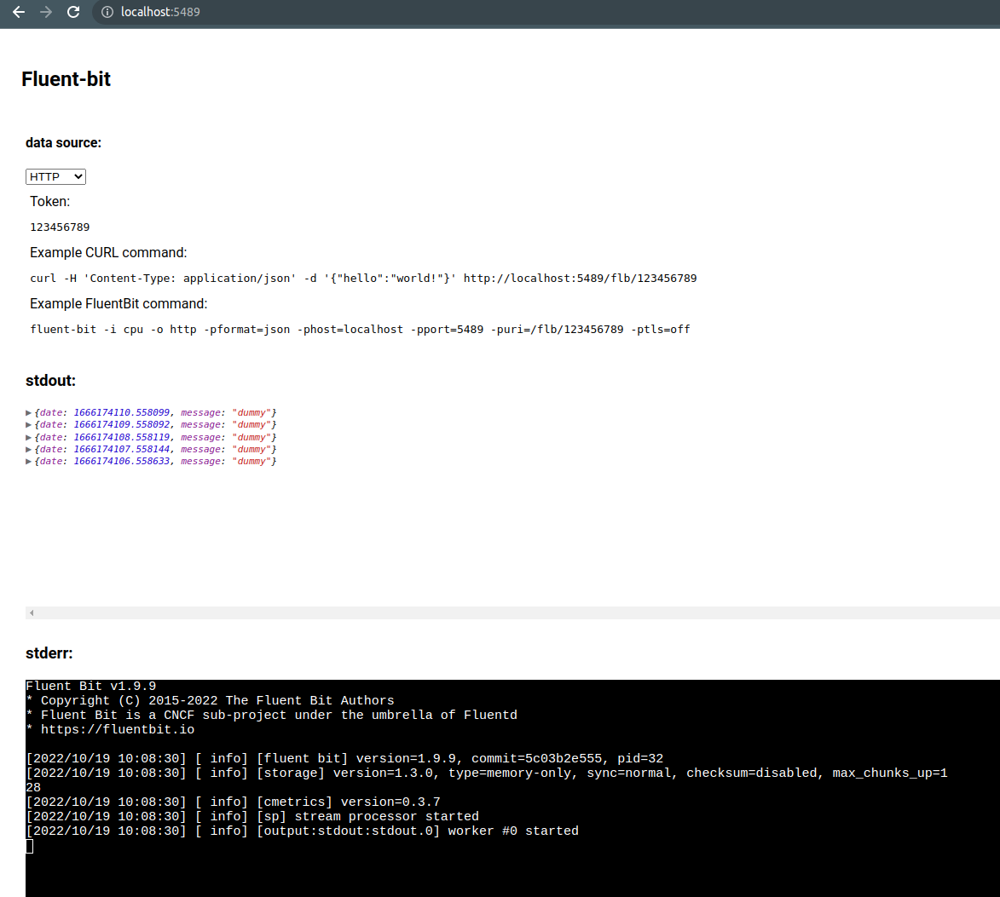

# Fluent-bit data visualizer

Simple web server to display received Fluent Bit messages.


## Development

```bash
docker compose up
```

## Production

To deploy in Kubernetes a YAML file is provided locally: [`kubectl apply -f ./vivo-dev.yaml`](./vivo-dev.yaml).

This provides a NodePort service so can be accessed anywhere in the cluster but external access may require an ingress.

To view the configuration of the service run `kubectl describe svc/calyptia-vivo` which will give you the NodePort value to use for Docker Desktop.

An example using KIND with Ingress from <http://localhost> is shown below:

```shell
kind create cluster --config=./kind/config.yaml
kubectl apply -f ./vivo-dev.yaml
./kind/setup-ingress.sh
```

This uses the set up as described in the KIND documentation just to forward all traffic to the HTTP service for Vivo: <https://kind.sigs.k8s.io/docs/user/ingress/>.

**NOTE: Vivo requires the UI to be open (or a websocket connection at least) before it can handle traffic.**

### Run latest build

```bash
docker run -ti --rm --name=vivo -p5489:5489 -p24224:24224 ghcr.io/calyptia/vivo
```

### Build locally

```bash
docker build -t vivo --target=prod .
docker run -ti --rm --name=vivo -p5489:5489 -p24224:24224 vivo
```
