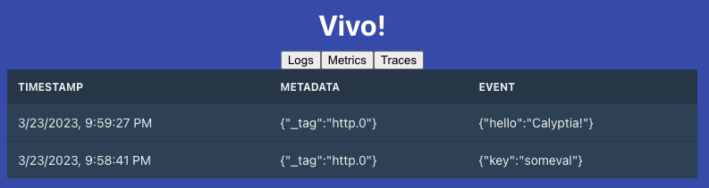

# Vivo

[Vivo](https://github.com/calyptia/vivo) provides a visualization interface for _logs_, _metrics,_ and _traces_.



## Architecture

The following components are used in Vivo:

- [packages/service](./packages/service): Golang service that starts/manages Fluent Bit
- [packages/frontend](./packages/frontend): Frontend React App that pulls telemetry data from Fluent Bit (new approach)
- [Fluent Bit](https://github.com/fluent/fluent-bit): telemetry agent with new export/streaming capabilities

To simplify the data management per type, Fluent Bit now supports a new output plugin called [Vivo Exporter](https://docs.fluentbit.io/manual/pipeline/outputs/vivo-exporter).
This plugin buffers telemetry data in a queue of a fixed size and exposes the content through HTTP endpoints: `/logs`, `/metrics`, `/traces`.
The UI part pulls data from there.

All the data retrieved from the Fluent Bit Vivo Exporter is in JSON format, and each event type has a well-defined specific structure.

## Running locally

A [K8S deployment is provided](./vivo-deployment.yaml) to simplify usage, e.g. with [KIND](https://kind.sigs.k8s.io/) which is used for CI testing.
This can also be run via [Podman](https://podman.io/): <https://docs.podman.io/en/latest/markdown/podman-kube.1.html>

The following end-points will be available:

| Port | Interface | Description |
| --- | --- | --- |
| 8000 | Web UI | The web interface for Vivo |
| 9000 | Forward Input | Data ingestion by using Fluent Forward protocol |
| 9010 | HTTP Input | Data ingestion through HTTP |
| 2025 | Vivo Exporter | Fluent Bit Vivo streams where the UI pulls data from. This is always exposed. |

These are provided on the `calyptia-vivo` service created by the deployment or locally if running in podman.
Port forwarding can be used to expose them locally.

To access the UI (make sure to forward the 2025 port otherwise it fails to connect via localhost to it):

```shell
kubectl port-forward svc/calyptia-vivo 8000:8000 2025:2025
```

You can access the Web interface by using the following address: <http://127.0.0.1:8000>

If you have Docker in your environment then start the services with `docker compose` (or for older versions `docker-compose`):

```shell
docker compose up
```

### Ingesting sample data

For K8S ensure an ingress or port-forward is set up:

```shell
kubectl port-forward svc/calyptia-vivo 9010:9010
```

Use `curl` to send to the HTTP input port:

```shell
curl -XPOST -H "Content-Type: application/json" -d '{"hello": "Calyptia!"}' http://127.0.0.1:9010
```

You can also check the Vivo Exporter directly via another endpoint:

```shell
kubectl port-forward svc/calyptia-vivo 2025:2025
```

Now hit the endpoint for logs, metrics or traces:

```shell
$ curl -i http://127.0.0.1:2025/logs
HTTP/1.1 200 OK
Server: Monkey/1.7.0
Date: Thu, 27 Apr 2023 14:35:09 GMT
Transfer-Encoding: chunked
Content-Type: application/json
Access-Control-Allow-Origin: *
Access-Control-Allow-Headers: Origin, X-Requested-With, Content-Type, Accept
Access-Control-Expose-Headers: vivo-stream-start-id, vivo-stream-end-id
Vivo-Stream-Start-ID: 0
Vivo-Stream-End-ID: 1

[[1682605659450986675,{"_tag":"http.1"}],{"hello":"Calyptia!"}]
```

## Development

To run a local version of storybook, use the following command:

`yarn workspace @calyptia-vivo/components storybook`

To publish storybook to Chromatic, run:

`yarn workspace @calyptia-vivo/components chromatic`

You must have the CHROMATIC_PROJECT_TOKEN set or specify it by adding the `--project-token` command line option.

To build components as a distributable package:

`yarn workspace @calyptia-vivo/components build`

Then

`yarn workspace @calyptia-vivo/components publish`

To run a local version of the frontend, use the following command:

`yarn workspace @calyptia-vivo/frontend start`

If you wish to test out your local development of the `components` package before publishing, use the `yarn link` command [See this guide on yarn link](https://classic.yarnpkg.com/lang/en/docs/cli/link/)

## Known Issues or fixes needed

- When ingesting 1 record with Curl, the UI is not rendering the content, but when sending a second record it gets rendered properly. This is a bug in the UI code.

- The UI tabs for metrics and traces should print just raw JSON. Note that for logs there is a expected schema where the UI use that to render the content. If metrics and traces are received, the rendering will fail due to the unexpected schema.

- UI parity level with original Vivo UI version.
