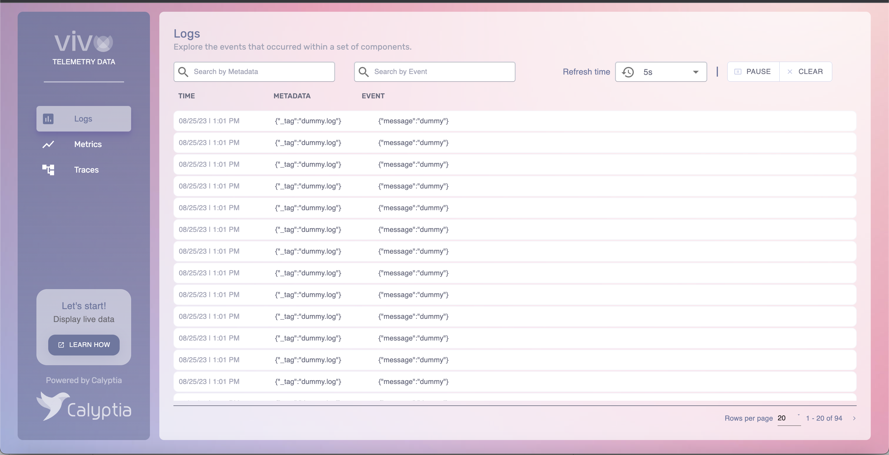
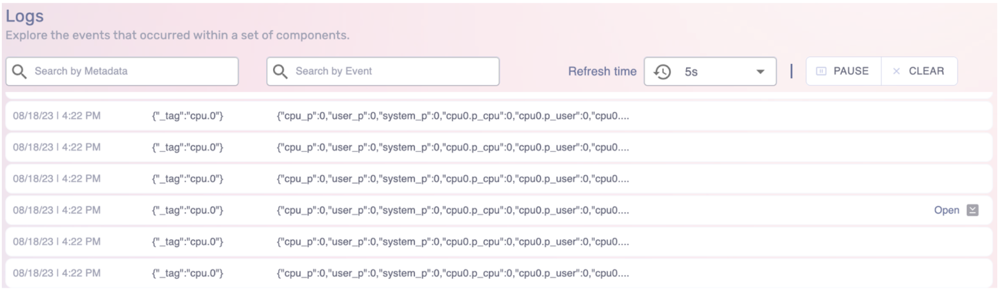
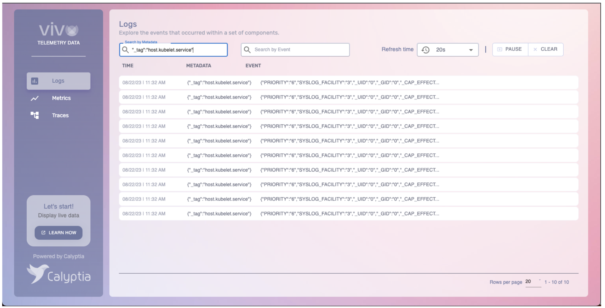
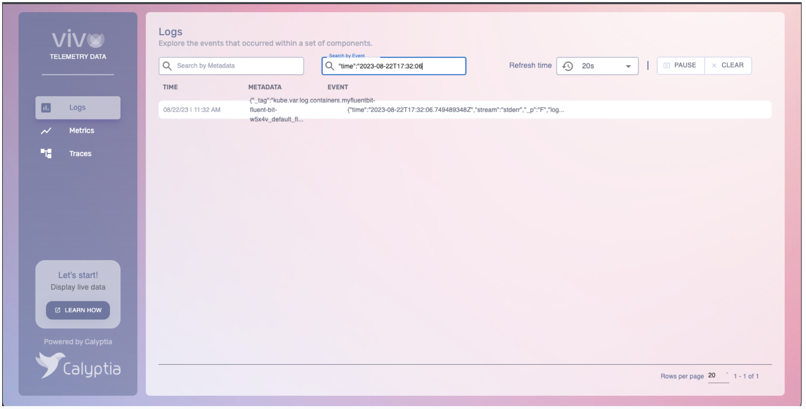
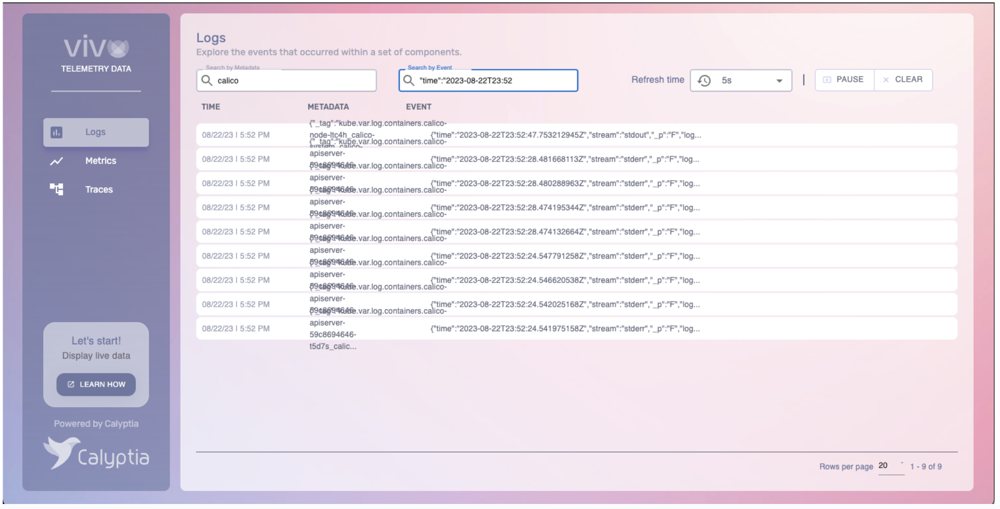

# Vivo Basic Usage

- [What is the value of Vivo?](#what-is-the-value-of-vivo)
   - [User Interface Description](#user-interface-description)
   - [Searching Logs, Metrics and Traces](#searching-logs-metrics-and-traces)
- [How can I start using it?](#how-can-i-start-using-it)
   - [Using Docker](#using-docker)
   - [Using Kubernetes](#using-kubernetes)
- [Where is my data sent over?](#where-is-my-data-sent-over)

## What is the value of Vivo?

Calytptia Vivo is a live viewer for Fluent Bit streams. It provides a visualization interface for logs, metrics, and traces. It supports the work to get insights into the behavior and performance of your software system by helping in understanding what is happening within your applications and infrastructure, diagnose issues, and optimize performance, allowing you to explore the events that occurred within a set of components and track the occurrence of an event to act on.

### User Interface Description

Its User Interface (UI) has a sidebar with three buttons for each telemetry data type: Logs, Metrics, and Traces. You can click on any of such controls and get the data displayed for each data type in the central pane. Once the data is displayed, browse it using your mouse scroll button.



If you require inspecting a specific line, you can expand it by clicking the label with the “Open” legend that appears at the right-most place of the line you are located at.

For example:



#### Searching Logs, Metrics and Traces

Through the UI, you can search logs, metrics, and traces by typing your search term in the search boxes of the UI. You can search logs by metadata, event, and both. The metrics and traces can be searched by event.

For example:

Searching logs by Metadata:



Searching by Event



Searching by Metadata and Event



## How can I start using it

A quick way to start using Vivo is by following the next steps.

### Using Docker

#### 1.- Execute Vivo by using the docker run command

You can execute Vivo using the docker run command to start a Docker container based on the “calyptia/vivo" image, forwarding ports 8000 and 9000 from your host machine to ports 3000 and 24224 inside the container, respectively. The “vivo” application inside the container will be executed as the main process. Once the container finishes its task, it will be automatically removed (because of the –rm flag).

```shell
 docker run --rm -p8000:3000 -p9000:24224 ghcr.io/calyptia/vivo vivo
```

#### 2a.- Collecting CPU usage with fluent-bit and forwarding it to Vivo

In another terminal, the following command runs Fluent Bit with the "cpu" input plugin to collect CPU usage metrics from the local system and forwards this data to Vivo, which runs on the same machine at TCP port 9000.

```shell
fluent-bit -i cpu -o forward://127.0.0.1:9000
```

#### 2b.- Collecting CPU usage, node_exporter_metrics and event_type with fluent-bit and forwarding it to Vivo

Alternatively, in another terminal, you can execute the following command that runs Fluent Bit with a configuration file in which the cpu, node_exporter_metrics, and event_type input plugins are set.

```shell
fluent-bit -c fluent-bit.conf
```

Where the fluent-bit.conf file contains the following:

```yaml
[SERVICE]
    Flush                1
    Log_level            info

[INPUT]
    Name                 node_exporter_metrics
    Tag                  node_metrics
    Scrape_interval      2

[INPUT]
    Name                 dummy
    Tag                  dummy.log
    Rate                 3

[INPUT]
    Name                 event_type
    Type                 traces

[OUTPUT]
    Name                forward
    Host                localhost
    Port                 9000
    match                *
```

#### 3.- Accessing the Vivo web UI

You can get access to the Vivo web user interface by using a browser and requesting the following URL: `http://localhost:8000/vivo/`

### Using Kubernetes

#### 1.- Create the calyptia-vivo deployment by using the kubectl create command and the vivo-deployment.yaml file

```shell
kubectl create -f vivo-deployment.yaml
```

vivo-deployment.yaml

```yaml
---
apiVersion: v1
kind: Service
metadata:
  annotations:
    app.kubernetes.io/name: vivo
    app.kubernetes.io/instance: calyptia
  name: calyptia-vivo
spec:
  ports:
    - name: "forward"
      port: 9000
      targetPort: 24224
    - name: "http"
      port: 9010
      targetPort: 9880
    - name: "vivo"
      port: 2025
      targetPort: 2025
    - name: "ui"
      port: 8000
      targetPort: 3000
    - name: "fluent-bit"
      port: 2020
      targetPort: 2020
  selector:
    app.kubernetes.io/name: vivo
    app.kubernetes.io/instance: calyptia
---
apiVersion: apps/v1
kind: Deployment
metadata:
  annotations:
    app.kubernetes.io/name: vivo
    app.kubernetes.io/instance: calyptia
  name: calyptia-vivo
spec:
  replicas: 1
  selector:
    matchLabels:
      app.kubernetes.io/name: vivo
      app.kubernetes.io/instance: calyptia
  template:
    metadata:
      labels:
        app.kubernetes.io/name: vivo
        app.kubernetes.io/instance: calyptia
    spec:
      containers:
        - image: calyptia/vivo
          imagePullPolicy: Always
          name: vivo
          ports:
            - name: forward
              containerPort: 24224
            - name: http
              containerPort: 9880
            - name: vivo
              containerPort: 2025
            - name: fluent-bit
              containerPort: 2020
            - name: ui
              containerPort: 3000
          readinessProbe:
            httpGet:
              path: /api/v1/health
              port: fluent-bit
            failureThreshold: 3
            periodSeconds: 5
          livenessProbe:
            httpGet:
              path: /api/v1/health
              port: fluent-bit
            failureThreshold: 5
            periodSeconds: 5
          resources:
            requests:
              memory: "64Mi"
              cpu: "250m"
            limits:
              memory: "128Mi"
              cpu: "500m"
      restartPolicy: Always
```

A service named calyptia-vivo will be created, exposing the Vivo endpoints.

```shell
$ kubectl get services

NAME            TYPE           CLUSTER-IP       EXTERNAL-IP   PORT(S)                                          AGE
calyptia-vivo   ClusterIP      10.102.243.246   <none>        9000/TCP,9010/TCP,2025/TCP,8000/TCP,2020/TCP     76ms

```

#### 2.- Accessing the Vivo web UI

##### Internally

2.a You can get access to the Vivo web user interface by using a browser and requesting the following URL: http://\<Internal Cluster-IP Address\>:8000/vivo/ where \<Internal Cluster-IP address\> is the IP address displayed under the “CLUSTER-IP” column for the calyptia-vivo service in the kubectl get services command output.
For example `http://10.102.243.246:8000/vivo/`

##### From the Internet

2.b.1 Suppose you require access to the Vivo web UI from the internet. In that case, you can create another service (for example, vivo-svc) of type Load Balancer by exposing the 3000 port of the calyptia-vivo deployment. For example:

```shell
kubectl expose deployment calyptia-vivo --type=LoadBalancer --port 3000 --name vivo-svc
```

2.b.2 Getting the TCP port that was mapped

```shell
$ kubectl get service vivo-svc

NAME       TYPE           CLUSTER-IP       EXTERNAL-IP   PORT(S)          AGE
vivo-svc   LoadBalancer   10.108.188.199   <pending>     3000:30204/TCP   62m
```

The 30204/TCP port is mapped to the 3000/TCP internal port.

2.b.3 Getting the external IP address

The external IP address will be the public IP address of your node.
For example:

```shell
$ curl ifconfig.io
35.225.96.210
```

2.b.4 Accessing the web UI through the Internet

You can get access to the Vivo web user interface by using a browser and requesting the following URL: http://\<Public-Node-IPAddress\>:\<Mapped-Port\>/vivo/ where \<Public-Node-IPAdress\> is the public address of your node and \<Mapped-Port\> is the port which was mapped when the LoadBalancer service was created.
For example:

`http://35.225.96.210:30204/vivo/`

2.b.5 Forwarding logs, metrics and traces to VIVO.

You can forward logs, metrics, and traces to Vivo by adding the following lines to the fluent-bit configuration file.

```yaml
[OUTPUT]
        Name                forward
        Host                < Internal Cluster-IP address>
        Port                 9000
        match                *
```

Where \<Internal Cluster-IP address\> is the Cluster IP address of the calyptia-vivo service, for example:10.102.243.246.

## Where is my data sent over?

The following table enumerates the Vivo end-points:

| Port | Interface | Description |
|----------|----------|----------|
| 8000     |  Web UI  | The web interface for Vivo |
| 9000     | Forward Input | Data Ingestion by using Fluent Forward protocol |
| 9010 | HTTP input | Data ingestion through HTTP|
| 2025 | Vivo Exporter | Fluent Bit Vivo streams where the UI pulls data from. This is always exposed. |

> Note: As can be noticed, Vivo ingests the data sent to its 9000 TCP port through the Fluent Forward protocol and, alternatively, to its 9010 TCP port through HTTP. For example:

  ```shell
    curl -XPOST -H "Content-Type: application/json" -d '{"hello": "Calyptia!"}' http://127.0.0.1:9010
  ```